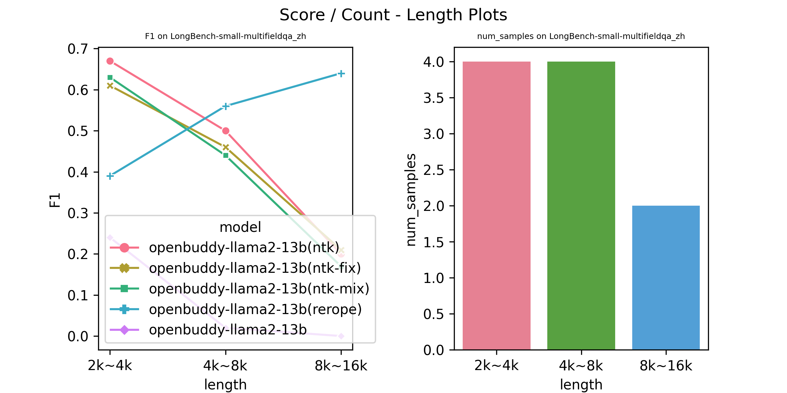
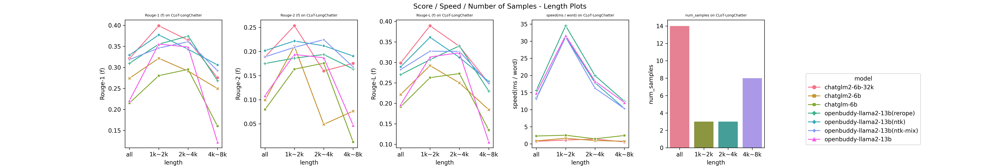
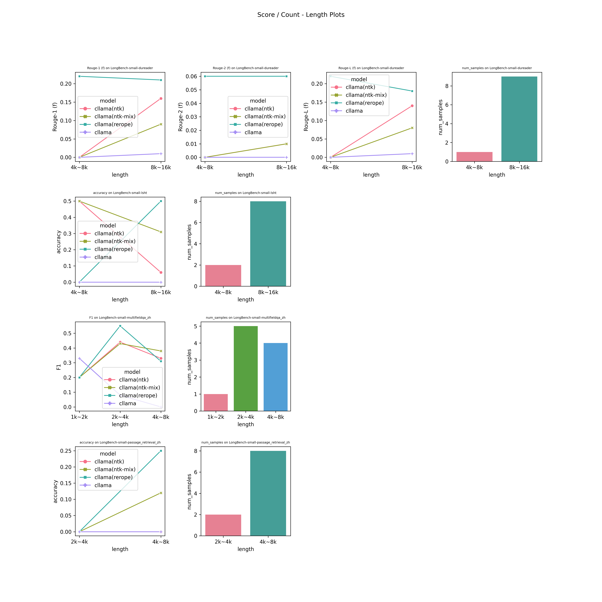
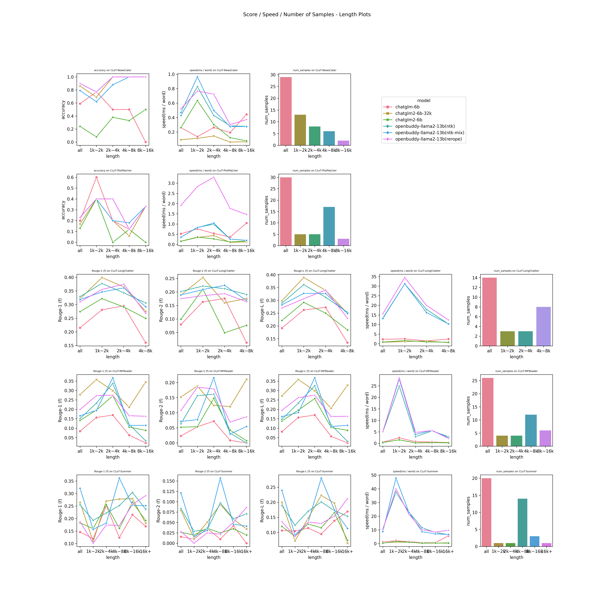
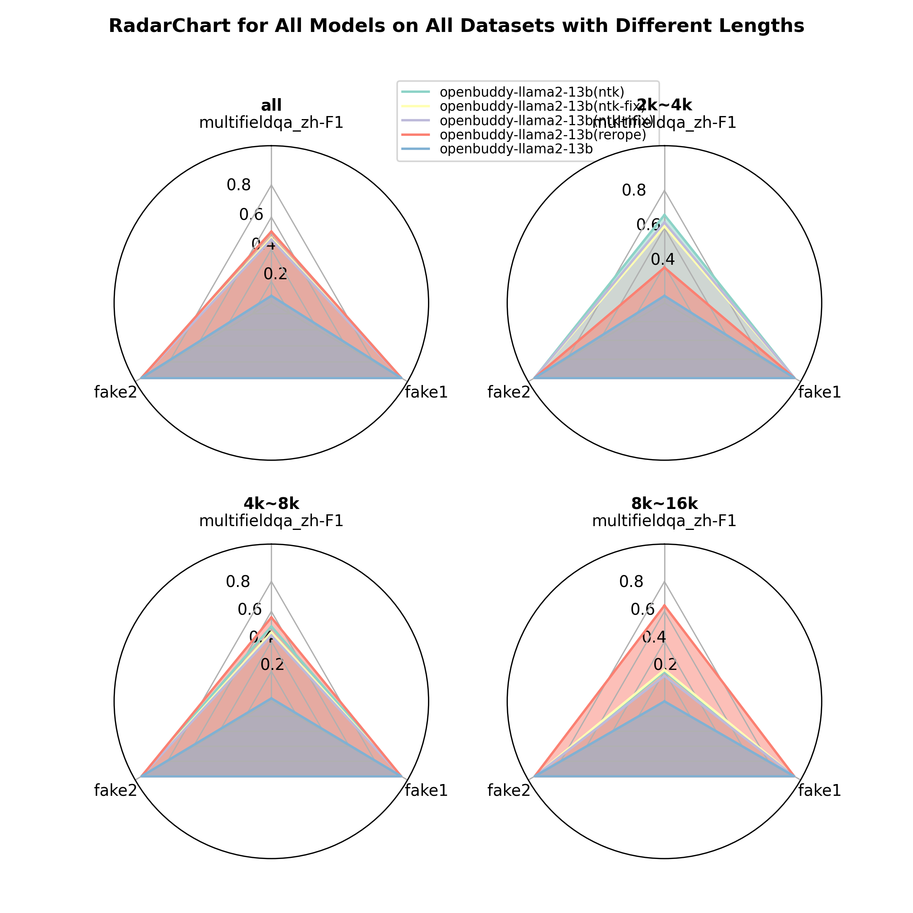
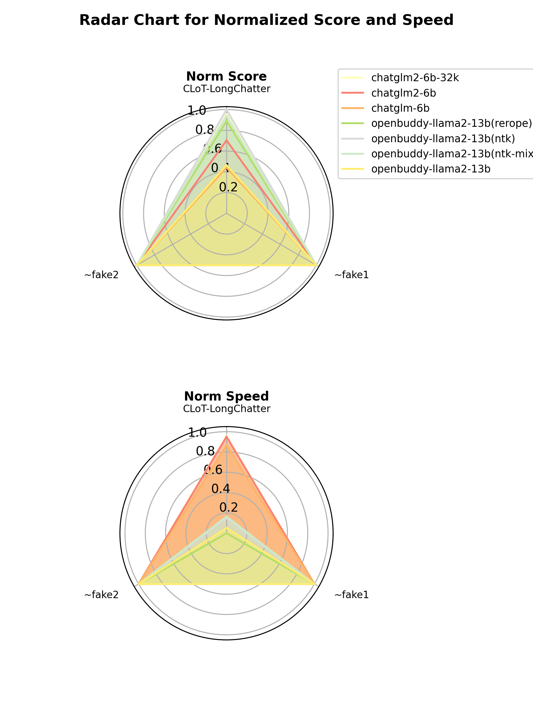
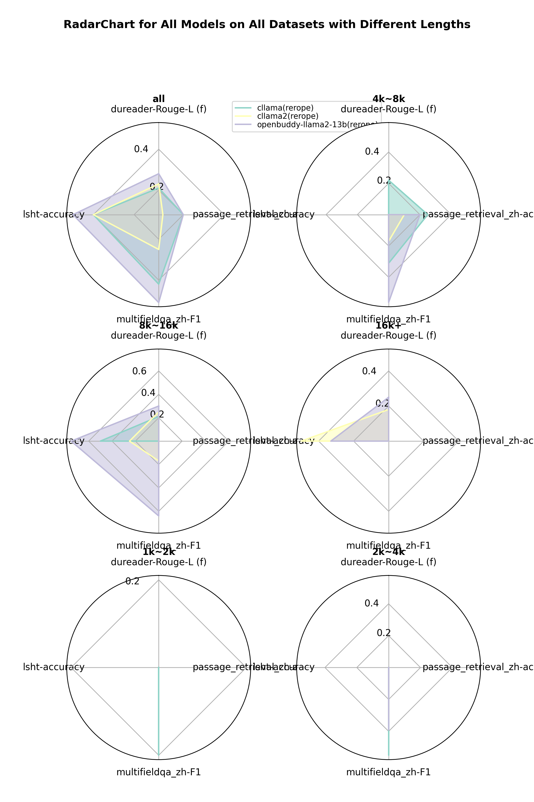
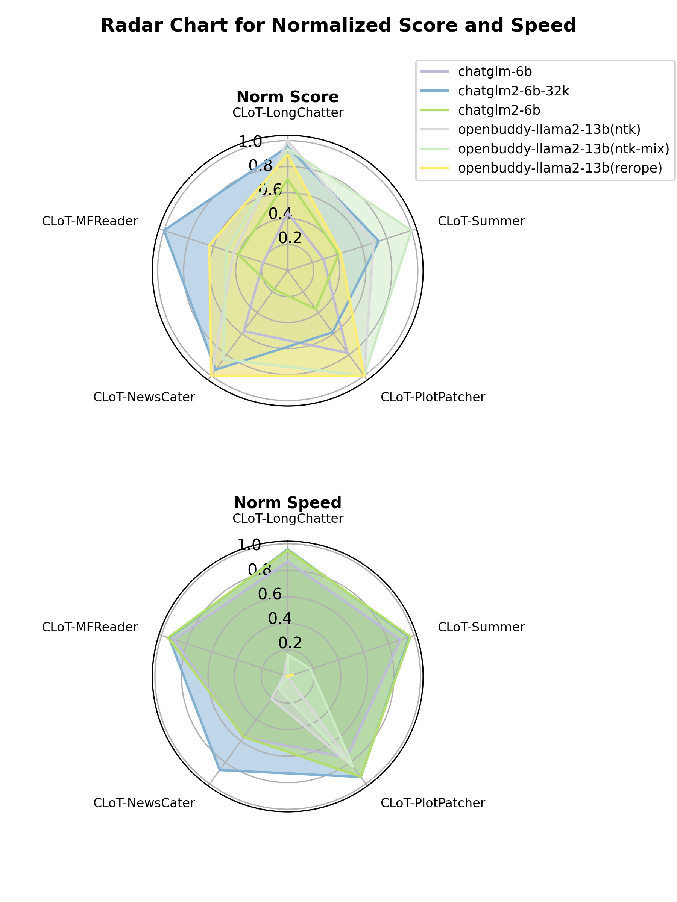
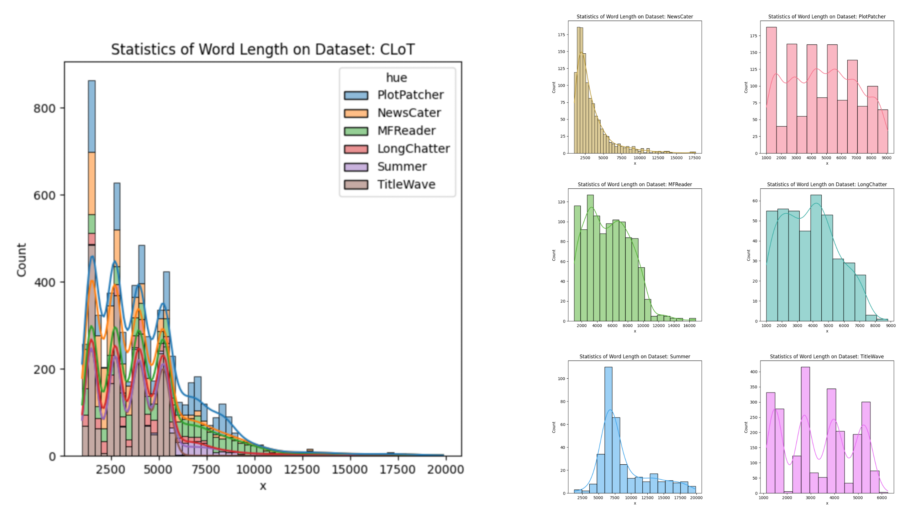
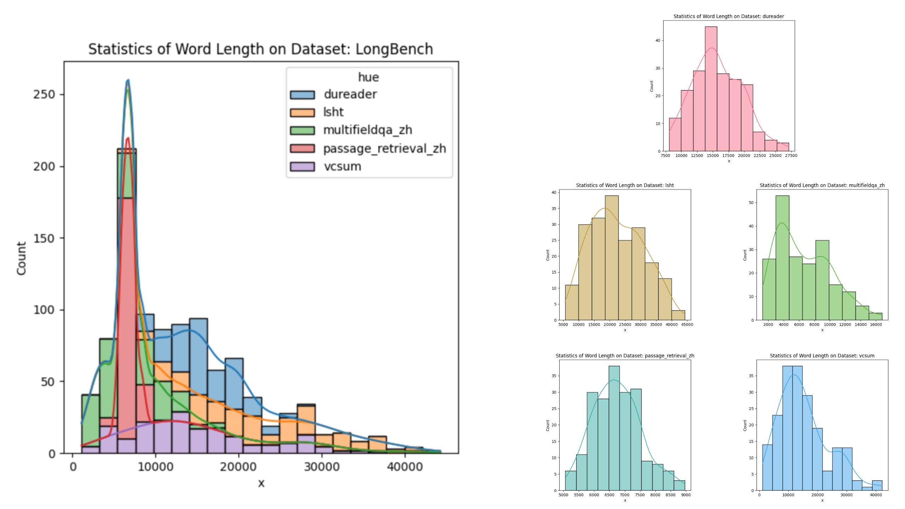

# long-llms-eval
A project to evaluate the long-context capabilities of the Transformer-based LLMs with specific benchmarks

## News

* We has just implemented an initial version of the flash-rerope aug method for llama! 

* This aug method fuses rerope into flash attention kernel function, based on [triton](https://github.com/openai/triton) libary developmented by openai. 

* And it worked fine for llama2-7B with **1k~20k** input texts and can be extrapolated far away to **64k** input texts on 8-A800 machine with tensor parallelism right now, by some prelimilary tests.

* However, it can not be compatible using auto device map parallelism, so the size of the model is the bottle neck for now. We will try to implement the general multi-gpu version of this method in the foreseeable future.

* You can refer to [flash_rerope_doc](https://ku.baidu-int.com/knowledge/HFVrC7hq1Q/ZCDDl-Da10/TDE-wsV4TC/TSkquOy7Hy7oOU) for more details about this implemetation.

*Note that:*

this version is dependent on **triton-nightly 2.1.0**, which is not available on pypi for now, and it can be installed by:
```shell
pip install -U --index-url https://aiinfra.pkgs.visualstudio.com/PublicPackages/_packaging/Triton-Nightly/pypi/simple/ triton-nightly
```


## Introduction

This is a benchmark to evalute Chinese Long-Context-Window Aug LLMs, including several **datasets** specifically designed for Chinese Long-Text tasks, like CLoT(our own), [LongBench](https://github.com/THUDM/LongBench), and a comprehensive length-aware **pipeline** to evaluate multiple lcw-aug LLMs on multitasks, with outputing some reader-friendly visualized reports

## Table of Contents

- [long-llms-eval](#long-llms-eval)
  - [News](#news)
  - [Introduction](#introduction)
  - [Table of Contents](#table-of-contents)
  - [Quick Start](#quick-start)
    - [Installation](#installation)
    - [Run Demo](#run-demo)
    - [Try Your Own](#try-your-own)
  - [Reference](#reference)
    - [Config](#config)
      - [File Format](#file-format)
      - [Model Config](#model-config)
      - [Dataset Config](#dataset-config)
    - [Dataset](#dataset)
    - [Model](#model)
    - [Evaluator](#evaluator)
    - [Output](#output)
    - [Jointly Report Mode](#jointly-report-mode)
  - [Appendix](#appendix)
    - [Dataset Infos](#dataset-infos)
    - [Model Infos](#model-infos)
    - [Decoding Strategies Infos](#decoding-strategies-infos)
    - [Aug Methods Infos](#aug-methods-infos)
  - [Citation](#citation)

## Quick Start

### Installation

```md
.
├── datasets
│   ├── CLoT
│   ├── LongBench
│   │   ├── v1.0
│   │   │   ├──debug
│   │   │   ├──large
│   │   │   ├──medium
│   │   │   ├──small
│   │   └── v2.0
├── evals
│   ├── configs
│   ├── outputs
│   ├── scripts
│   ├── ...
│   └── eval.py
├── imgs
|── .gitignore
|── README.md
|── requirements.txt
```


* Step1: clone this repo to your own workshop, and you can get the repo with file structure as above:
```bash
git clone https://github.com/Strivin0311/long-llms-eval.git
```

* Step2: (*optional*) create the conda env with python3.8
```bash
conda create -n long-llms-eval python=3.8
conda init bash
```
* Step3: activate `long-llms-eval` env (or your own conda env if skipping step2), and install the required packages
```bash
conda activate long-llms-eval
pip install --upgrade -r requirements.txt
```

### Run Demo

* Step1: go into the `evals/` folder, and run the demo script
```bash
cd evals && sh scripts/demo/eval_obllama2_chatglm32k_clot_demo.sh
```
* Step2: you will see a whole pipeline runing process in the terminal until `All Done!` comes up, during which you can check the `./configs/demo/obllama2[rerope+flash-ntk]_chatglm32k_clot_dev_demo.json` to take a first look at the [config](#config) infos about this demo experiment
* Step3: then you can go inot the `./outputs/exp-config[obllama2[rerope+flash-ntk]_chatglm32k_clot_dev_demo.json]-time[%Y-%m-%d %H:%M]` folder, where the `time` is specific to your current timestamp
* Step4: under the output folder, you can open 
    * `error.json`: it contains the error messages for the samples encountering some errors during evaluations, usually `CUDA OOM` error
    * `leaderboard.md`: it compares all models' performance and inference speed on each task, splitted by context length
    * `plot.png`: it shows different models' performance and inference speed change with context length growing
    * `radarchart.png`: it offers a global view of models' all-round normalized performance and inference speed on every task(note that: *where `fake{i}` indicates one fake dataset, which is only for visualization effects*) 

* Note that: the *visible gpus* are set as one of `args` for `eval.py`, you can use the example command below to set your own *visible gpus*, default as `0 1 2 3 4 5 6 7`

```bash
python eval.py --config-path xxx.json --gpus 0 1 2 3 5
```

### Try Your Own

then you can try your own experiements with the [reference](#reference) below!

## Reference

### Config

This is the design to specific the pipeling configuration arguments, including models configuration, datasets configuration

#### File Format

All the configuration files are under `./configs` folder, and with file format `.json`

In any `config.json` file, you can see several main keys:

```json
"register_class": "base_evaluator", 
"exp_name": "",
"model_configs": [{}],
"dataset_configs": [{}],
```

* `register_class`: to indicate the [evaluator](#evaluator) class key to use, now only supports `'base_evalutor'`
* `exp_name`: the experiment name you like to name the output directory, keep it empty to use the default format: `exp-config[{config_file_name}]-time[%Y-%m-%d %H:%M]`
* `model_configs`: a list of several [model config](#model-config) json dict, each of which indicates a model's configuration
* `dataset_configs`: a list of several [dataset config](#dataset-config) json dict, each of which indicates a dataset(task)'s configuration


Here's one template config example below, from `./configs/config_template.json`, where each value is replaced with a descrption string:

```json
{
    "register_class": "required a registered Evaluator class key here, default as 'base_evaluator'",
    "exp_name": "you can speficify the name of the exp you want, or keep it empty to use the timestamp + config_file_name",
    "model_configs": [
        {
            "register_class": "required a registered LCWAugModel (sub)class key here",
            "model_name": "required a specific model's name you like here",
            "model_path": "required a model loading path here",
            "tokenizer_path": "the tokenizer loading path here, you can keep it empty to use the corresponding model's path",
            "use_cache": "'true' / 'false' to specify whether to use the cache in model.generate call or not, default 'true'",
            "use_fast_tokenizer": "whether to use the fast rust-based tokenizer, default 'true', setting if to 'false' will use python-based tokenizer",
            "max_prompt_length": "the maximum length of the prompt words, if over, truncate it, default as 32k, and -1 means no limit",
            "torch_dtype": "the torch dtype string of the model you want, default using float16, you can also use bfloat16, etc",
            "device_map": "the device map distribution, default using 'auto', or you can pass 'single' to use the only first gpu, or more generally, pass the dict-like device map to specify",
            "tensor_parallel": "whether to use tensor parallel, default 'false' for not using",
            "decode_strategy": "the string to set how to decode the output text from the model's logits, default using 'greedy', the other choices are 'beam', 'topk_sampling', 'topp_sampling', etc, depending on the model",
            "aug_method": "you can set the aug method here, or keep it empty for no aug",
            "[additional config]": "any basic python type"
        }
    ],
    "dataset_configs": [
        {
            "register_class": "required a registered LCWDataset (sub)class key here",
            "dataset_name": [
                "required the specific dataset's loading name(s) here, following the hugging-face style"
            ],
            "dataset_path": "required the specific dataset's loading path here, default loading from the huggingface.co if empty",
            "split": "the split of the dataset to be actually used, default as 'test' ",
            "batch_size": "the batched sample number to be used during one iteration, default as 1(int)",
            "prompt_template": "you can set the specific prompt template you need here, or keep it empty to let it be generated automatically probably",
            "max_new_tokens": "the maximum number of new tokens to be generated by the model for this dataset, -1 means no limit, default using 0 to let dataset handle it",
            "length_splits": [
                "the lengths of the different length split ranges, default as [1000, 2000, 4000, 8000, 16000](List[int])"
            ],
            "metrics": [
                "the metrics used for evaluating the model, you can keep it empty list to use the metrics defined in the dataset itself"
            ],
            "main_metric": "the main metric for evaluating the model, keep it empty to default use the first metric in the score output",
            "few_shot": "the number of few-shot examples, default set 0, i.e. zero-shot setting",
            "few_shot_split": "the split of the dataset for few-shot setting, default as 'dev' ",
            "few_shot_prefix": "the few-shot example prefix prompt, default empty, but should be set when using few-shot setting, maybe specific to dataset",
            "few_shot_suffix": "the few-shot example suffix prompt, default empty, but should be set when using few-shot setting, maybe specific to dataset",
            "[additional config]": "any basic python type"
        }
    ]
}
```


The corresponding config class is `Config` and `EvaluatorConfig`  in the `./config.py`

#### Model Config

In any `config.json` file, each json dict under the `model_configs` list indicates a single model's configuration, whose keys include but are not limited to:

* `register_class`: the class key name for one specific [model](#model) class, the currently registered models can be found in [Model Infos](#model-infos)
* `model_name`: the name you like to refer to this model, which should be unqiue in one experiment, e.g. you may name `llamba2-13b(flash-ntk)` for a model which is based on LLaMA2 and aug by NTK-RoPE with Flash Attention
* `model_path`: the path to the model dir which can be load using `huggingface transformers`
* `tokenizer_path`: the path to the tokenizer dir which can be load using `huggingface transformers`, you can keep it empty string to default using 'model_path'
* `use_cache`: whether to use kv cache when generating answers token by token to save attention computation, default setting to `'true'`
* `max_prompt_length`: the maximum length of prompt words, default 32k, and -1 means no limit, and if the original prompt length is over, it will be truncated from the middle. following the LongBench way 
* `use_fast_tokenizer`: whether to use fast tokenizer implemented by rust, default `'true'`, and if not, it will use python-based tokenizer
* `torch_dtype`: the pytorch dtype to quantify the models' parameters, such as `'bfloat16'`, `'float16'`, default using `'float16'`
* `device_map`: the device map to dispatch parameters, default using `'auto'` to automatically dispatch from all the available devices
* `tensor_parallel`: whether to use tensor parallel to wrap the model, deault setting to `'false'`
* `decode_strategy`: the decoding strategy to get the prediction from the model, default supporting `'greedy'`(*default choice*), `'beam'`, `'sampling'`, `'constrative'`, `abcd`, you can see the details of these strategies in `decode.py` and tune the parameters in the model config
* `aug_method`: the aug method to use, which is depedent to the model based on, e.g. for LLaMA-based models, now `'base_llama'` [model](#model) class supports: `logn`, `flash`, `ntk`, `ntk-fix`, `ntk-mix`, `rerope` and `rerope-leaky`, or keep it empty string to only use the base model
* `[additional config]`: the specific configs for the [model](#model) class with respect to `register_class`, like decoding strategies params like `top_p`, `temperature` and aug methods params like e.g. `ntk_ratio`, `logn`, `flash` for `'base_llama'` [model](#model) class, all of which have default values to use implicitly

The corresponding model config class is `ModelConfig`  in the `./config.py` 

#### Dataset Config

In any `config.json` file, each json dict under the `dataset_configs` list indicates a single dataset(task)'s configuration, whose keys include but are not limited to:

* `register_class`: the class key name for one specific [dataset](#dataset) class, the currently registered datasets can be found in [Dataset Infos](#dataset-infos)
* `dataset_name`: the loading name following `huggingface datasets` style, e.g. `['LongBench-small', 'multifieldqa_zh']` indicates the `Multi-Fied QA` task under small(toy) [LongBench](https://github.com/THUDM/LongBench) dataset
* `split`: the specific split of the dataset you want to load, choosing from `{'train', 'test', 'val', 'dev'}`
* `batch_size`: the batch size to iterate the [dataset](#dataset) class object in one time, default using `1`, 
* `prompt_template`: the prompt template string to format one sample from the dataset to the exact input to the model, e.g. `'prompt: \n{prompt}\n\nquestion: \n{question}'\n\noutput: \n`, keep it empty to use the default one set in the `register_class`
* `max_new_tokens`: the maximum new tokens to let the model generate,  e.g. `-1` means no limits, `0`(default) means no setting but let the [dataset](#dataset) handle it
* `length_splits`: the length split ranges to scores samples in each length range, default as `[1000, 2000, 4000, 8000, 16000]`, note that: *if the dataset has no samples within certain range, then there's no report for this range*
* `metrics`: the metrics used for evaluating the model, keeping it empty to default use the metrics defined in the dataset
* `main_metric`: the main metric if there's multi ones, to be used in the radarchart, default using the first metric in the score output
* `ppl_metric`:  whether to evaluate the ppl metric, default as `false` 
* `few_shot`: the number of few-shot examples when iterating the dataset in few-shot setting, default 0 as zero-shot setting
* `few_shot_prefix`: the prefix string to introduce the few shot examples, default empty to use the default one
* `few_shot_suffix`: the suffix string to append after few shot examples and introduce the real prompt, default empty to use the default one
* `[additional config]`: the specific configs for the [dataset](#dataset) class with respect to `register_class`

The corresponding dataset config class is `DatasetConfig`  in the `./config.py`

### Dataset

Under `./dataset.py` file, you can see:

* `LCWDataset`: the base class to handle Chinese Long-Text datasets, including functions:
    * load: to load hugging-face dataset, metric and specific prompt template and max new tokens optionally
    * forward: to score batched predictions from the model with the corresponding references
    * iter: to yield batched inputs and references to feed into models and do scoring later
* other subclasses inheritted from the base class `LCWDataset` for the specific dataset, e.g. `CLoTLCWDataset` is for CLoT(our own) dataset and `LongBenchLCWDataset` is for [LongBench](https://github.com/THUDM/LongBench)
* `dataset_registry`: the registry dict to register the [dataset](#dataset) class, otherwise it cannot be load
* `load_dataset`: the function to load the [dataset](#dataset) class from a [dataset config](#dataset-config)

You can modify the functions or define your own dataset by `3` steps:
* Step1: inherit the (sub)class existed and (over)write your own functions
* Step2: register it into the `dataset_registry`, i.e. give it a unqiue class key name
* Step3: set it into the key `register_class` in any [dataset config](#dataset-config) dict

### Model

Under `./model.py` file, you can see:

* `LCWAugModel`: the base class to handle LCW-Aug LLMs, including functions:
    * load: to load hugging-face model and tokenizer
    * forward: to get the predictions from inputs, with some specific decoding strategy
    * decode: to implement different decoding strategies, including but not limited to greedy search, beam search, sampling, topk sampling, topp sampling, etc
    * aug: to aug the model to be better at long-text inputs, note that: *it is not implemented into the base class for now, since different models may have their own aug methods*
* other subclasses inheritted from the base class `LCWAugModel` for the specific model, e.g. `LLaMALCWAugModel` is for LLaMA-based models implemented by `huggingface transformers`
* `model_registry`: the registry dict to register the [model](#model) class, otherwise it cannot be load
* `load_model`: the function to load the [model](#model) class from a [model config](#model-config)

You can modify the functions or define your own model by `3` steps:
* Step1: inherit the (sub)class existed and (over)write your own functions
* Step2: register it into the `model_registry`, i.e. give it a unqiue class key name
* Step3: set it into the key `register_class` in any [model config](#model-config) dict


### Evaluator

Under `./evaluator.py` file, you can see:

* `Evaluator`: the base class to hanle the evaluation pipeline in one experiemnt, including functions:
    * instantiate: to use config to instantiate the models and datasets involved in this experiment
    * forward: to run evaluation pipeline, for each model on each dataset
    * evaluate: to evaluate certain model on certain dataset
    * report: to report the evaluation outputs into reader-friendly files
* `evaluator_registry`: the registry dict to register the [evaluator](#evaluator) class, otherwise it cannot be load
* `load_evaluator`: the function to load the [evaluator](#evaluator) class from [config](#config)

You can modify the functions or define your own evaluator by `3` steps:
* Step1: inherit the (sub)class existed and (over)write your own functions
* Step2: register it into the `evaluator_registry`, i.e. give it a unqiue class key name
* Step3: set it into the key `register_class` in any [config](#config) dict

### Output

The output for any experiement will be all saved under the `{output-dir}/{exp-name}` folder, where the `output-dir` can be set in the argument `--output-dir` when running `python eval.py` (default `./outputs`), and `exp-name` can be set in the key `exp_name` in [config](#config) dict (default using format `exp-config[{config_file_name}]-time[%Y-%m-%d %H:%M]`)  

Under any output folder, you can see:

* `error.json`: it stores the error messages for all samples which were caught error during evaluating, usually `CUDA OOM` error, and the format is shown as below:
```json
[{
    "error_message": "CUDA out of memory...",
    "error_time": "%Y-%m-%d %H:%M",
    "error_model": "model_name",
    "error_dataset": "dataset_name",
    "error_sample_idx": "sample_idx if sample_idx is not None else -1",
}]
```

* `output.json`: it stores the whole outputs for all evaluations, and the format is shown as below(*Note that: the speed's unit is (second / word)*):
```json
{
    "dataset_name1": {
        "model_nameA": {
                "pred_output": [ {} ], 
                "score_output": {
                    "all": {"acc": 0.5, "speed": },
                    "<1k": {"acc": 0.5, "speed": },
                    "1k~2k": {"acc": 0.5, "speed": },
                    "2k+": {"acc": 0.5, "speed": },
                }
        }, 
    },
    "dataset_name2": {
        "model_nameA": {
                "pred_output": [ {} ], 
                "score_output": {
                    "all": {"acc": 0.5, "speed": },
                    "<1k": {"acc": 0.5, "speed": },
                    "1k~2k": {"acc": 0.5, "speed": },
                    "2k+": {"acc": 0.5, "speed": },
                }
        }, 
    }, 
}
```
* `output_model[{model_name}]_dataset[{dataset_name}].json`: it stores the outputs for certain model and cetain dataset, the format is shown as below:
```json
{
    "model_name": "",
    "dataset_name": "",
    {
        "pred_output": [ {} ], 
        "score_output": {
            "all": {"acc": 0.5, "speed": },
            "<1k": {"acc": 0.5, "speed": },
            "1k~2k": {"acc": 0.5, "speed": },
            "2k+": {"acc": 0.5, "speed": },
        }
    } 
}
```
* `leaderboard.md`: the leaderboard table to compare all models' performance and inference speed on each task in each length range, the examples are shown as below:

*LeaderBoard for CLoT-LongChatter (all-length-range):*
|                               | Rouge-1 (f)   | Rouge-2 (f)   | Rouge-L (f)   | speed(sec/word)   | num_samples   |
|:------------------------------|:--------------|:--------------|:--------------|:------------------|:--------------|
| chatglm2-6b-32k               | 3.21e-01      | 1.89e-01      | 2.99e-01      | 7.51e-04          | 14            |
| chatglm2-6b                   | 2.74e-01      | 9.92e-02      | 2.22e-01      | 8.80e-04          | 14            |
| chatglm-6b                    | 2.15e-01      | 7.98e-02      | 1.92e-01      | 2.31e-03          | 14            |
| openbuddy-llama2-13b(rerope)  | 3.10e-01      | 1.75e-01      | 2.70e-01      | 1.56e-02          | 14            |
| openbuddy-llama2-13b(ntk)     | 3.29e-01      | 2.02e-01      | 2.89e-01      | 1.34e-02          | 14            |
| openbuddy-llama2-13b(ntk-mix) | 3.19e-01      | 1.89e-01      | 2.82e-01      | 1.32e-02          | 14            |
| openbuddy-llama2-13b          | 2.21e-01      | 1.09e-01      | 1.97e-01      | 1.48e-02          | 14            |


* `plot.png`: the score-length curve plot to compare all models' performance and inference speed change with length growing for each metric on each task, the examples are shown as below:

*The OpenBuddy LLaMA-based aug models and ChatGLMs on CLoT single-task (LongChatter)*
<!--  -->


*The OpenBuddy LLaMA-based aug models and ChatGLMs on CLoT multi-tasks*
<!--  -->


* `radarchart.png`: the radar chart to compare all models' all-round normalized performance and inference speed on all tasks for each length range, the examples are shown as below (note that: *fake{i} is only the placeholder for visualization*):

*The OpenBuddy LLaMA-based aug models and ChatGLMs on CLoT single-task (LongChatter)*
<!--  -->



*The OpenBuddy LLaMA-based aug models and ChatGLMs on CLoT multi-tasks*
<!--  -->


### Jointly Report Mode

If you've had a bunch of experiments with several models on several datasets, you may want to aggregate them together to give a comprehensive report (*especially you have limited time/memory resource to run all models on all datasets in one config*)

then you can use this `jointly-report-mode` to run `eval.py`, which can aggregate the outputs from different experiments to give a jointly report, including `output.json`, `leaderboard.md`, `plot.png`, `radarchart.png`

Here're the steps below:

* Step1: assuming you have `output_model[A]_dataset[B].json` in `outputs/exp-config[1]`, `output_model[C]_dataset[B].json` in `outputs/exp-config[2]`, and you want to compare the two models `A` and `C` on dataset `B` in the same report
* Step2: you copy the two output json files into one new directory, e.g. `outputs/report_AC_B` as you like
* Step3: then you can run the `eval.py` using the *report run-mode* as below:
```bash
python eval.py \
    --run-mode report \
    --report-dir outputs/report_AC_B \
    --verbose
```
* Step4: after a few seconds, you can get the report directory `outputs/report_AC_B/exp-time[%Y-%m-%d %H:%M]` just like the regular output directory as your previous experiments, with `output.json`, `leaderboard.md`, `plot.png`, `radarchart.png` in side with A,C and B jointly
* Step5: you can also check the script `scripts/report_llama_longbench_small.sh` as an example


## Appendix

### Dataset Infos

Here's a list of current supported long-text dataset(task) infos:

```json
"CLoT": {
    "dataset_root": "../datasets/CLoT",
    "subtasks / configs": {
        "PlotPatcher": """
        Multi-Choice QA: This is a subtask dataset belonging to the MCQA metask in CLoT benchmark, 
        which asks LLMs to select the right plot sentence from 4 candidates for one of a bunch of storys, 
        each of which has only one <MASK> place to put the candidate plot sentence
        """,
        "NewsCater": """
        Multi-Choice QA: This is a subtask dataset belonging to the MCQA metask in CLoT benchmark,
        which asks LLMs to choose the right category that a bunch of news most probably belong to
        """,
        "THUCNewsMCQA": """
        Multi-Choice QA: This is a subtask dataset belonging to the MCQA metask in CLoT benchmark, 
        which asks LLMs to choose the right category that a long news most probably belongs to
        """,
        "MFReader": """
        Extractive QA: This is a subtask dataset belonging to the ExtQA metask in CLoT benchmark, 
        which asks to LLMs to retrieve the possible answers corresponding to the questions in the single/multi-documents
        """,
        "LongChatter": """
        Extractive QA: This is a subtask dataset belonging to the ExtQA metask in CLoT benchmark, 
        which asks to LLMs to retrieve the possible answers corresponding to the questions in a long chat history with specific timestamps 
        """,
        "THUCNewsExtQA": """
        Extractive QA: This is a subtask dataset belonging to the ExtQA metask in CLoT benchmark, which asks to LLMs to retrieve the possible answers corresponding to the questions in a long news 
        """,
        "Summer": """
        Summarization: This is a subtask dataset belonging to the Summ metask in CLoT benchmark, 
        which asks to LLM to summarize the specific contents from one user or all the users, given a bunch of contents from different users
        """,

    }
}
```

Here're several statistics histgrams for CLoT and each subtasks:


```json
"LongBench": {
   "dataset_root": "../datasets/LongBench", 
   "split_size": "",
    "split_version": "",
   "subtasks / configs": {
        "dureader": "Multi-doc QA: Answer related Chinese questions based on multiple retrieved documents",
        "lsht": "Few shot Classification: A Chinese classification task that requires categorizing news, includes 24 categories in total",
        "multifieldqa_zh": "Single-doc QA: Answer Chinese questions based on a long article, which comes from a relatively diverse field",
        "passage_retrieval_zh": "Synthetic Matching: Given several Chinese paragraphs from the C4 data set, determine which paragraph the given abstract corresponds to",
        "vcsum": "Summarization: A summarization task that requires summarizing Chinese meeting records"
   }
}
```
where `split_version` can be choose from: (*v1.0 is deprecated*)
* `v2.0`: for the latest sampling split sizes, details as below

where `split_size` can choose from:
* `debug`: for `v2.0` it was just randomly choosen 1 sample from each subtask with length limit ranging from 1k~20k
* `small`: for `v2.0` it was just randomly choosen 10 samples from each subtask with length limit ranging from 1k~20k
* `medium`: for `v2.0` it was just randomly choosen 50 samples from each subtask with length limit ranging from 1k~20k
* `large`: for `v2.0` it was just randomly choosen 100 samples from each subtask with length limit ranging from 1k~20k

*Note: you can set `split_version` and `split_size` as the addtional config in the dataset config for `LongBench`*

Here're several statistics histgrams for (original) LongBench and each subtasks:



### Model Infos

Here's a list of basic information about current supported aug models:

```json
"base_llama": {
    "descrption": "The registered base aug model class for Llama-based models, like openbuddy-llama-13b, llama2-7b, etc",
    "notice": "1. The 'use_fast' config for tokenizer is DISABLED in base_llama, i.e. ONLY the python-based tokenizer will be used for base_llama models",
    "additional_config": {},
    "tested_models": [
        "openbuddy-llama2-13b-v8.1-fp16",
    ]
},
"base_chatglm": {
    "descrption": "The registered base aug model class for ChatGLM-based models, like chatglm-6b, chatglm2-6b, chatglm-6b-32k, etc",
    "notice": "1. The base_chatglm model can ONLY be used in single-gpu and non-tensor-parallel mode because ChatGLM models are not supported for now",
    "additional_config": {},
    "tested_models": [
        "THUDM-chatglm-6b",
        "hatglm2-6b",
        "chatglm2-6b-32k"
    ]
},
"base_ernie": {
    "descrption": "The registered base aug model class for ERNIE-Bot models with only remote API access, like ernie-bot-13b-8k, etc",
    "notice": "1. The base_ernie model can ONLY be loaded and used with remove API call, so some custom configurations may be DISABLED such as decoding strategies, aug methods, etc | 2. The speed measurement makes no sense between it and other locally loaded models because of extra network traffic time",
    "additional_config": {
        "server_url": "The url to post a request for remove API call",
        "timeout": "The request timeout (seconds)"
    },
    "tested_models": [
        "https://aip.baidubce.com/rpc/2.0/ai_custom/v1/wenxinworkshop/chat/eb-instant",
    ]
}
```


### Decoding Strategies Infos

Here's a list of current supported decoding strategies for all `base_model` with its arguments' default values, you can see `decode.py/DecodingStrategy` for more details:

```json
"base_model": {
    "greedy": {

    },
    "beam": {
        "num_beams": 5
    },
    "sampling": {
        "top_p": 0.95,
        "top_k": 50,
        "temperature": 0.01,
    },
    "contrastive": {
        "top_k": 4,
        "penalty_alpha": 0.6,
    },
    "abcd": {
        "choices": ["A", "B", "C", "D"]
    }
}
```


### Aug Methods Infos

Here's a list of current supported aug methods for `base_llama` with its arguments' descriptions and default values, you can see `aug.py/LLaMAAugManager` for more details:

```json
"base_llama": {
    "ntk": {
        "logn": "whether to apply the logn scaling, default False", 
        "training_length": "the logn scaling param, default set to 2048",
        "flash": "whether to use flash attn to speed up and save memory, default False", 
        "flash_impl": "the flash attn param to choose the implementation version, default 'vanilla-v2'", 
        "dynamic": "whether to use dynamic ntk, when True, the ntk ratio won't be applied, default False", 
        "ntk_ratio": "the ntk ratio to make the context incremented by ratio times, default 8"
    },
    "ntk-fix": {
        "logn": "whether to apply the logn scaling, default False", 
        "training_length": "the logn scaling param, default set to 2048",
        "flash": "whether to use flash attn to speed up and save memory, default False", 
        "flash_impl": "the flash attn param to choose the implementation version, default 'vanilla-v2'", 
        "dynamic": "whether to use dynamic ntk, when True, the ntk ratio won't be applied, default False", 
        "ntk_ratio": "the ntk ratio to make the context incremented by ratio times, default 8"
    },
    "ntk-mix": {
        "logn": "whether to apply the logn scaling, default False", 
        "training_length": "the logn scaling param, default set to 2048",
        "flash": "whether to use flash attn to speed up and save memory, default False", 
        "flash_impl": "the flash attn param to choose the implementation version, default 'vanilla-v2'", 
        "dynamic": "whether to use dynamic ntk, when True, the ntk ratio won't be applied, default False", 
        "ntk_ratio": "the ntk ratio to make the context incremented by ratio times, default 8",
        "ntk_mix_b": "the ntk-rope-mix hyper-param for the exp solution to the lambda function, default 0.625",
    },
    "rerope": {
        "logn": "whether to apply the logn scaling, default False", 
        "flash": "whether to use flash attn to speed up and save memory, default False", 
        "rerope_window": "the window size for the rerope design, default 512",
        "rerope_length": "the training length of the LLaMA model, e.g. 2048 for LLaMA, and 4096 for LLaMA2, default 4096",
        "flash_rerope_inner_apply": "whehter to apply rerope inside the kernel by blocks, default False",
    },
    "rerope-leaky": {
        "logn": "whether to apply the logn scaling, default False", 
        "rerope_window": "the window size for the rerope design, default 512",
        "rerope_length": "the training length of the LLaMA model, e.g. 2048 for LLaMA, and 4096 for LLaMA2, default 4096",
        "rerope_scaling_factor": "the scaling times for the context window, the same as ntk_ratio in ntk methods, used only rerope-leaky aug method, default 8" 
    },
    "flash": {
        "flash_impl": "the implementation version of flash-attention, 'vanilla-v2'(default) means the vanilla implementation from DaoAILab/flash-attention v2.0.0, 'pytorch-v2' means the implementation of scaled-dot-product-attention from pytorch2.0"
    },
    "logn": {
        "training_length": "the training length of the model, to scale the q value by max( 1, log_{training_length}n ), where n is the seq length"
    }
}
```


## Citation


